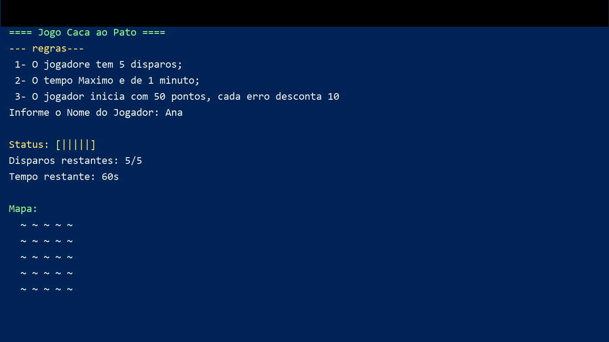
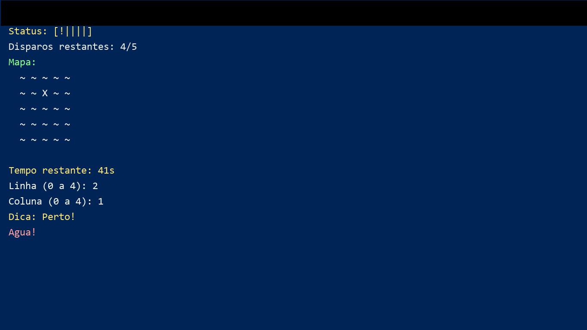
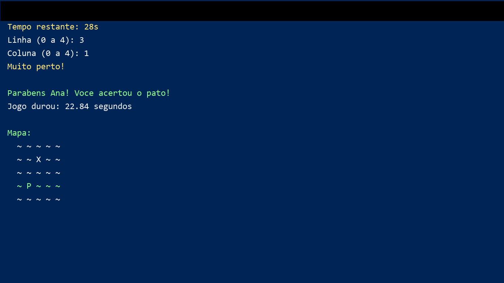
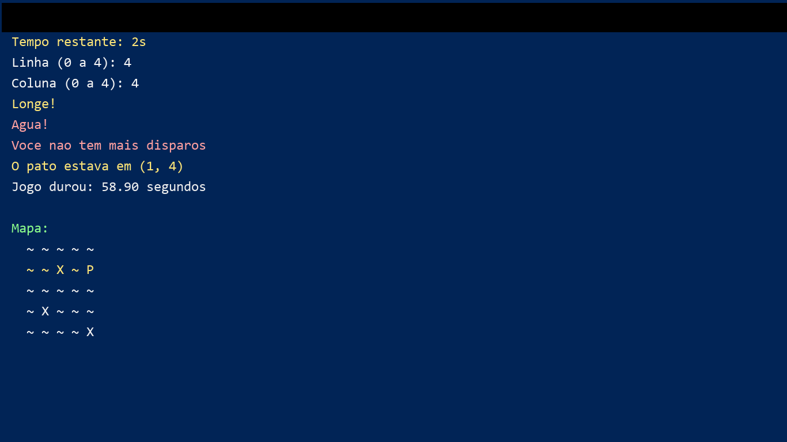

# Jogo Caça ao Pato em Grid

Projeto em Python com mecânica de caça ao pato em um grid 5x5, usando entradas por linha/coluna no terminal, limite de disparos e tempo máximo de partida.

## Objetivo do jogo

Acertar a posição do pato escondido no grid antes de:

- acabar o tempo (60 segundos), ou
- acabar os disparos (5 tentativas).

## Demonstração (imagens)

As imagens devem ser salvas em `docs/img/`.

### Tela inicial



### Partida em andamento



### Vitória



### Derrota




## Arquitetura do projeto

Estrutura atual:

- `pato.py`: código principal do jogo.
- `ranking.txt`: histórico de resultados (`nome;resultado;duracao`).
- `docs/img/`: pasta de imagens da execução.

Fluxo de execução:

1. Exibe regras e solicita o nome do jogador.
2. Inicializa variáveis do jogo (grid, disparos, tempo, posição do pato).
3. Entra no loop principal (`while True`) até vitória, fim do tempo ou fim de disparos.
4. Registra o resultado no `ranking.txt`.

## Comentários por bloco do código

### 1) Imports e inicialização

- Importa `random` para sortear a posição do pato.
- Importa `time` para controlar duração da partida.
- Importa `colorama` para colorir mensagens no terminal.
- Chama `init(autoreset=True)` para resetar as cores automaticamente.

### 2) Apresentação e entrada inicial

- Mostra título e regras do jogo.
- Lê o nome do jogador.
- Registra `hora_inicial` para cálculo de tempo.

### 3) Variáveis de estado

- `tamanho = 5`: tamanho do grid.
- `disparos = 5`: número de tiros disponíveis.
- `tempo_limite = 60`: tempo máximo em segundos.
- `grid`: matriz 5x5 iniciada com ondas (`🌊`).
- `pato_linha`, `pato_coluna`: posição sorteada do pato.
- `tentativas`: lista para impedir tiros repetidos.
- `icones`: barra visual de status dos disparos.

### 4) Função `mostrar_status()`

Responsável por exibir:

- barra visual de tiros (ícones),
- disparos restantes,
- estado atual do mapa.

### 5) Loop principal da partida

No `while True`, o código:

- calcula tempo restante,
- encerra se o tempo acabou,
- encerra se os disparos acabaram,
- mostra status atual,
- lê linha/coluna digitadas pelo jogador,
- valida faixa do grid,
- bloqueia repetição de tentativa,
- calcula distância Manhattan para dar dica (`quente/frio`),
- verifica acerto ou erro,
- atualiza grid e disparos.

### 6) Encerramento e persistência

Ao final da partida:

- revela posição do pato em caso de derrota,
- calcula duração total,
- grava no arquivo `ranking.txt` o resultado da sessão.

## Como executar

### Pré-requisitos

- Python 3.10+ (recomendado)
- Biblioteca `colorama`

Instalação da dependência:

```bash
pip install colorama
```

Execução:

```bash
python pato.py
```

## Exemplo de uso

1. Digite seu nome.
2. Informe `Linha` e `Coluna` (0 a 4).
3. Use as dicas de proximidade para chegar até o pato.
4. Verifique o resultado final e o histórico no `ranking.txt`.

## Melhorias futuras

- Adicionar menu principal com opções (jogar, ver ranking, sair).
- Separar código em funções para facilitar manutenção.
- Criar testes unitários para validações de entrada.
- Permitir níveis de dificuldade (grid e tempo variáveis).
